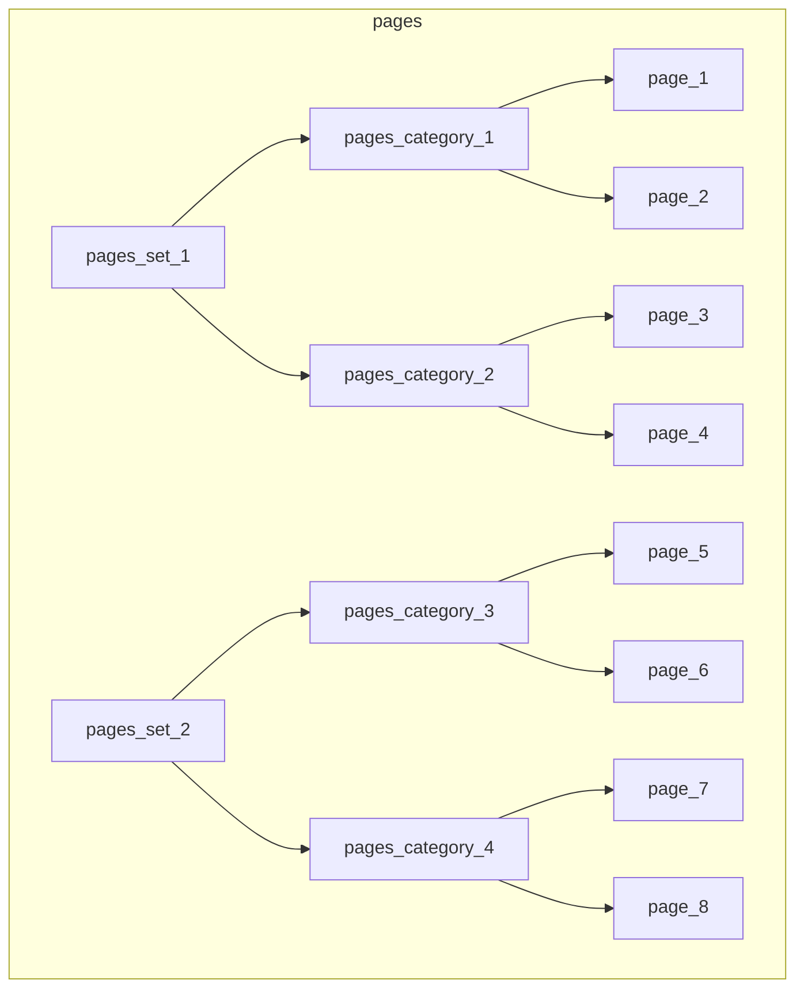
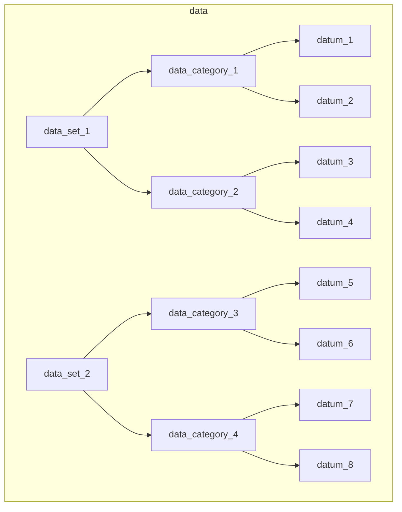

<h1> <code>EikonProject\Paginator</code> PHP Package </h1>

[](https://github.com/EIKONproject/paginator/actions/workflows/check-package.yml)
[](https://opensource.org/license/gpl-3-0/)

PHP package enabling basic metadata and pagination on PHP based websites

- [Documentation](https://eikonproject.github.io/paginator/)
- [Coverage report](https://eikonproject.github.io/paginator/coverage/)

<h2> Contents </h2>

- [Test website](#test-website)
- [Concept](#concept)
  - [Pages and data](#pages-and-data)
  - [Folder structure, `metadata.json` and `index.php` files](#folder-structure-metadatajson-and-indexphp-files)
- [Development](#development)
  - [Composer](#composer)
  - [Linting and formatting](#linting-and-formatting)
  - [Testing](#testing)
  - [Coding standards](#coding-standards)
  - [Documentation](#documentation)

# Test website

To see how the paginator runs on a local test website, run:
```sh
env UID=${UID} GID=${GID} docker compose up
```

The website will be available at `localhost:8999`.

# Concept

## Pages and data

The paginator works gathering and processing metadata from two basic **entities**:

- **Page**: any element which is reflected by a page in the website (e.g. posts, articles, etc...)
- **Datum**: any element which is not reflected by a page in the website (e.g. people, places, etc...)

Each entity is grouped by a **category** and each category belongs to a **set**. In general, a website can be summed up by a set of pages sets and data sets:





## Folder structure, `metadata.json` and `index.php` files

Given a root folder for the website (e.g. `htdocs` for an apache server) the files have to be in the following structure:

```
htdocs/
├── data/ (not accessible from the frontend)
|   |
|   ├── data_set_1/
|   |   ├── metadata.json
|   |   ├── data_category_1/
|   |   |   ├── metadata.json
|   |   |   ├── datum_1/
|   |   |   |   └── metadata.json
|   |   |   ├── datum_2/
|   |   |   |   └── ...
|   |   |   └── ...
|   |   ├── data_category_2/
|   |   |   └── ...
|   |   └── ...
|   |
|   └── data_set_2
|       └── ...
|
├── pages_set_1/
|   ├── metadata.json
|   ├── pages_category_1/
|   |   ├── metadata.json
|   |   ├── page_1/
|   |   |   ├── metadata.json
|   |   |   └── index.php
|   |   ├── page_2/
|   |   |   └── ...
|   |   └── ...
|   ├── pages_category_2/
|   |   └── ...
|   └── ...
|
└── pages_set_2
    └── ...
```

As we can see, every set, category and entity has associated a specific `metadata.json` file containing the metadata needed by that specific PHP class.

Pages have an additional `index.php`, which is the page associated to the page entity which is available on the frontend.


# Development

## Composer

The package is developed with [`composer`](https://getcomposer.org/) on PHP 7.4.

We suggest using the [docker `composer` image](https://hub.docker.com/_/composer):
```sh
docker run -tti --rm -v $(pwd):$(pwd) -w $(pwd) --user $(id -u):$(id -g) composer:latest [COMMAND_HERE]
# For example
docker run -tti --rm -v $(pwd):$(pwd) -w $(pwd) --user $(id -u):$(id -g) composer:latest --help
```

## Linting and formatting

For linting, we use the [`cytopia/phplint`](https://github.com/cytopia/docker-phplint) docker image:
```sh
docker run -tti --rm -v $(pwd):/data cytopia/phplint --help
# To lint
docker run -tti --rm -v $(pwd):/data cytopia/phplint
```

For formatting, we use the [`cytopia/php-cs-fixer`](https://github.com/cytopia/docker-php-cs-fixer) docker image:
```sh
docker run -tti --rm -v $(pwd):/data cytopia/php-cs-fixer --help
# To dry run
docker run -tti --rm -v $(pwd):/data cytopia/php-cs-fixer fix --dry-run --diff .
# To fix stuff
docker run -tti --rm -v $(pwd):/data cytopia/php-cs-fixer fix .
```

For code quality assessment, we use [`phpmd` (PHP mess detector)](https://phpmd.org/download/index.html), and it can be run via the composer docker image:
```sh
docker run -tti --rm -v $(pwd):$(pwd) -w $(pwd) --user $(id -u):$(id -g) composer:latest ./vendor/bin/phpmd . github cleancode,codesize,design,naming,unusedcode --exclude 'tests/*,vendor/*'
```

## Testing

For testing, we use [`phpunit` 9.6](https://docs.phpunit.de/en/9.6/), and it can be run via the composer docker image:
```sh
docker run -tti --rm -v $(pwd):$(pwd) -w $(pwd) --user $(id -u):$(id -g) composer:latest ./vendor/bin/phpunit tests
```

## Coding standards

We follow the [PHP coding standards](https://github.com/php/php-src/blob/master/CODING_STANDARDS.md) with further enforcement where loose:
- function and variable names are `snake_case`
- class names are `PascalCase`
- Iterators and Exceptions are simply postfixed with `Iterator` and `Exception` (e.g. `ArrayIterator`, `LogicException`)
- names starting with `__` are reserved for magic methods

## Documentation

For documenting functions, we use [WordPress convention](https://developer.wordpress.org/coding-standards/inline-documentation-standards/php/).

To build the package documentation, we use [phpDocumentor](https://phpdoc.org/):
```sh
docker run -tti --rm -v $(pwd):$(pwd) -w $(pwd) --user $(id -u):$(id -g) phpdoc/phpdoc:3 --help
# To generate the documentation of the src/
docker run -tti --rm -v $(pwd):$(pwd) -w $(pwd) --user $(id -u):$(id -g) phpdoc/phpdoc:3 -d src
```

To check that the documentation up to date and properly written, we use [`phpdoc-checker`](https://github.com/php-censor/phpdoc-checker), and it can be run via the composer docker image:
```sh
docker run -tti --rm -v $(pwd):$(pwd) -w $(pwd) --user $(id -u):$(id -g) composer:latest ./vendor/bin/phpdoc-checker --help
# To check the src/ directory
docker run -tti --rm -v $(pwd):$(pwd) -w $(pwd) --user $(id -u):$(id -g) composer:latest ./vendor/bin/phpdoc-checker -d src
```
